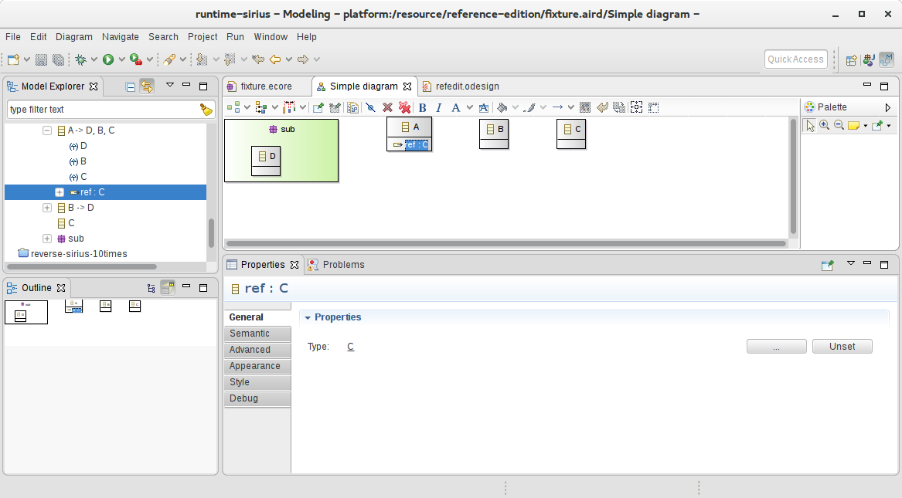
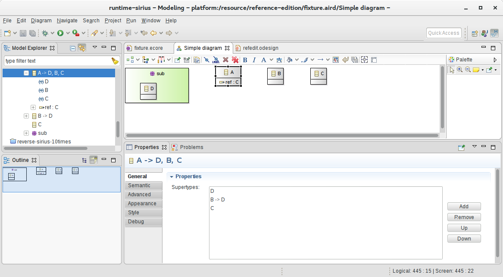
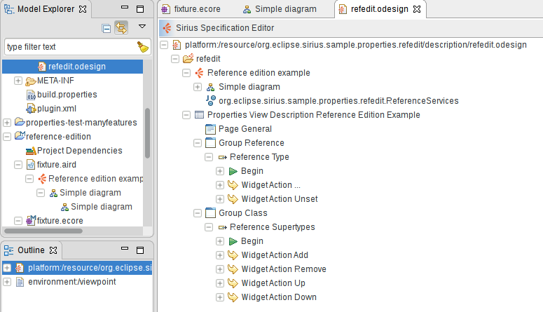

# Sirius Properties Views Example - Reference Widgets

This example illustrates how to configure a "Reference" widget using Sirius 4.0 properties view.

To test:
1. Make sure Sirius 4.0 is installed, with the Properties View optional features.
2. Import both projects in the workspace.
3. Open the diagram in the `reference-edition` modeling project.

If you select the `ref` reference defined in class `A`, you'll see an example of a single-valued reference widget:

If you select a class, for example `A`, you'll see an example of a multi-valued reference widget (here showing the super-types):

The definition of both widgets can be seen in the `refedit.odesign` file, and use some additional Java services in the `ReferenceServices.java` file.

